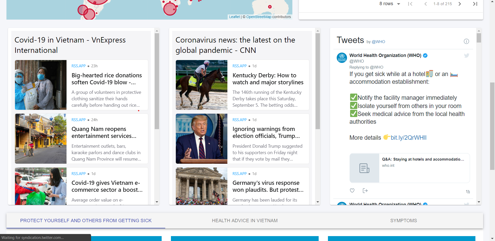

# Covid-19 Tracker

## About

> A website to track all COVID cases in the world daily, get the latest news, and give information to protect ourself from it

## Technology

-   ReactJS

## Features

-   Responsive
-   SASS for styling
-   Material-UI
-   Material-Table for dynamic country table
-   Chartjs for building beautiful chart
-   Leaflet Map for track cases in the world
-   RSS.app for new feeds

## API

-   Using Disase.sh v3 for getting data
-   Link: https://disease.sh/docs/

## Demo

## Screenshots

## Resources

-   https://www.who.int/emergencies/diseases/novel-coronavirus-2019/advice-for-public
